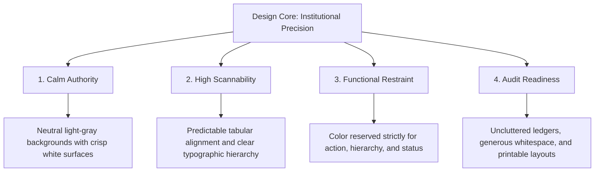

# 🏛️ Cooperative Rural Bank Management System (CRBMS)
## Enterprise UI Redesign Specification & Implementation Plan
**Direction:** *From Vibrant Glass Control Panel → Calm Institutional Ledger*

---

> [!IMPORTANT]
> **Executive Mandate:** The Cooperative Rural Bank Management System (CRBMS) is transitioning its visual and architectural identity from a high-density, dark-mode glassmorphism control room to a **formal, minimal, professional enterprise ledger**. This specification defines the exact design tokens, layout structures, component standards, and page-by-page refactoring rules required to build an audit-ready, dependable banking platform for tellers, branch managers, regulatory auditors, and cooperative members.

---

### 1. Design Principles

To achieve an institutional grade of precision and trust, all interface decisions must adhere to four foundational principles:



1. **Calm Authority Over Visual Intensity:** Remove decorative friction. Replace translucent layers, heavy backdrop blurs, and neon glows with solid, softly elevated white surfaces on off-white backgrounds. The UI must project dependability and permanence.
2. **High Scannability in High-Frequency Environments:** Branch staff execute hundreds of repetitive transactions daily. Information must be structured with clear typographic hierarchy, consistent row heights, and strict tabular numeric alignment so ledgers can be parsed in seconds without optical fatigue.
3. **Functional Restraint (Color as Data):** Color is not decoration; it is a semantic signal. Neutral cool grays dominate the workspace. Brand blue is reserved strictly for primary interactive controls, while muted semantic tones (emerald, amber, rose) indicate transaction states and credit risk.
4. **Audit Readiness & Unambiguous Hierarchy:** Every screen must be instantly understandable to an external auditor or a newly onboarding teller. Avoid decorative badges and visual noise; prioritize clear data tables, explicit confirmation boundaries, and self-explanatory form groupings.

---

### 2. Color System

The palette shifts from a dark-slate HSL theme to a **neutral-first, institutional light palette**. Contrast ratios strictly exceed WCAG AA standards (4.5:1 for normal text, 3:1 for large text and interface boundaries).

| Token Name | Hex Code | Tailwind / CSS Variable | Functional Application |
| :--- | :--- | :--- | :--- |
| **Background** | `#F8FAFC` | `--bg-workspace` / `slate-50` | Base application background for the overall viewport and layout frame. |
| **Surface** | `#FFFFFF` | `--bg-surface` / `white` | Cards, modals, drawers, data tables, and form container surfaces. |
| **Border** | `#E2E8F0` | `--border-default` / `slate-200` | Thin structural boundaries for cards, table dividers, and input fields. |
| **Border Focus** | `#0284C7` | `--border-focus` / `sky-600` | Input focus rings, active tab indicators, and primary container highlights. |
| **Text Primary** | `#0F172A` | `--text-main` / `slate-900` | Page titles, section headings, table cell data, and primary button labels. |
| **Text Secondary** | `#64748B` | `--text-muted` / `slate-500` | Field labels, helper text, timestamps, table column headers, and sub-captions. |
| **Brand Accent** | `#0284C7` | `--accent-brand` / `sky-600` | Primary call-to-action buttons, active navigation links, and key numerical highlights. |
| **Success (Muted)**| `#059669` | `--status-success` / `emerald-600` | Active accounts, completed deposits, RLS security confirmation, and positive cashflow. |
| **Warning (Muted)**| `#D97706` | `--status-warning` / `amber-600` | Pawn tickets nearing 45-day expiry, guarantor notice badges, and pending authorizations. |
| **Danger (Muted)** | `#DC2626` | `--status-danger` / `red-600` | Overdue loans, forfeited pledges, destructive actions, and high LTV risk limits (>80%). |

> [!TIP]
> **Rule of Restraint:** Never use background fills for status badges if text color and a thin border suffice. Use soft tinted backgrounds (`rgba(5, 150, 105, 0.08)`) only for compact status chips.

---

### 3. Typography System

The typography relies on a **single sans-serif family (`Inter`)** for clean modern legibility, paired with **strict tabular lining figures** for all numerical ledgers.

```carousel

<!-- slide -->
```
```css
/* Core Typographic Scale & Rules */
--font-sans: 'Inter', -apple-system, BlinkMacSystemFont, "Segoe UI", Roboto, sans-serif;
--font-mono: 'JetBrains Mono', 'Fira Code', 'Courier New', monospace;
```

| Element Type | Size / Line-Height | Font Weight | Tracking / Kerning | Usage Rules |
| :--- | :--- | :--- | :--- | :--- |
| **Page Title** | `24px` (`1.5rem`) / `32px` | `600` (SemiBold) | `-0.02em` | Main page header (e.g., *Member Directory*, *Pawning Ledger*). |
| **Section Heading**| `18px` (`1.125rem`) / `24px`| `600` (SemiBold) | `-0.01em` | Card headers, drawer titles, and major form section groupings. |
| **Body Text** | `14px` (`0.875rem`) / `20px` | `400` (Regular) | `0` | Standard narrative text, descriptions, and modal dialogues. |
| **Field Labels** | `12px` (`0.75rem`) / `16px` | `500` (Medium) | `+0.01em` | Input labels, table column headers (uppercase optional, keep subtle). |
| **Table Data** | `14px` (`0.875rem`) / `20px` | `400` (Regular) | `0` | Standard text cells within ledgers (left-aligned). |
| **Numeric Ledgers**| `14px` (`0.875rem`) / `20px` | `500` (Medium) | `0` *(Tabular)* | Currency (`Rs. 1,250,000.00`), interest rates, and IDs (`MEM-000001`). Must use `font-variant-numeric: tabular-nums;` and be right-aligned. |

---

### 4. Layout System

The workspace is designed around a **predictable 3-zone geometric grid** that eliminates visual shifting as users navigate between operational modules.

```mermaid
graph LR
    subgraph Viewport [100vw x 100vh Workspace]
        Nav[Left Sidebar / Compact Nav<br>Width: 240px<br>Bg: #0F172A or #FFFFFF] 
        subgraph Main [Content Area: flex-1, max-w-7xl]
            Head[Top Header Area<br>Height: 64px<br>Title + Breadcrumb + Primary CTA]
            Body[Primary Focus Canvas<br>Padding: 24px 32px<br>Single Module Purpose]
        </Main>
    end
```

#### **A. Spatial Zones & Spacing Tokens**
* **Header Zone (`64px` height, sticky):** Houses the active institutional context (*Kattankudy MPCS Ltd - Branch KTK-01*), breadcrumbs, and exactly **one Primary CTA** (e.g., `+ New Member` or `+ Issue Loan`).
* **Navigation Zone (`240px` width, static):** A clean vertical list with generous item padding (`10px 16px`). Active states use a solid subtle background (`#F1F5F9`) and a `3px` left indicator bar (`#0284C7`), avoiding glow effects.
* **Content Canvas:** Max-width constrained to `1280px` (`max-w-7xl`) centered, or full-width with `32px` margins for dense accounting ledgers.
* **Spacing Scale:**
  * **Macro-spacing (Between Sections):** `24px` (`1.5rem`) to `32px` (`2rem`).
  * **Micro-spacing (Within Cards & Forms):** `16px` (`1rem`) card padding; `12px` (`0.75rem`) form field vertical spacing; `8px` (`0.5rem`) label-to-input gap.

---

### 5. Component Standards

Every component must follow strict structural discipline. Remove all backdrop filters, multi-colored border gradients, and layered translucencies.

#### **A. Cards & Surfaces**
* **Appearance:** Solid white (`#FFFFFF`) background, thin border (`1px solid #E2E8F0`), and a micro-radius (`6px` or `8px`).
* **Elevation:** Use flat borders by default. Apply a subtle box-shadow (`0 1px 3px 0 rgba(0, 0, 0, 0.05)`) only for interactive cards or floating drawers.
* **Rule:** One card = one operational purpose. Do not nest bordered cards inside other bordered cards.

#### **B. Tables & Accounting Ledgers**
* **Border Noise:** Remove vertical column borders. Use a single horizontal divider (`1px solid #F1F5F9`) between rows.
* **Row Height:** Standardize to exactly `44px` for data rows and `36px` for table headers to ensure comfortable touch and mouse targets.
* **Header Styling:** Light gray background (`#F8FAFC`), muted text (`#64748B`), font weight `500`. Sticky positioning enabled for tables exceeding 15 rows.
* **Column Alignment:**
  * Text (Names, Descriptions, Status): Left-aligned.
  * IDs, Dates, and Codes (`MEM-000001`, `2026-07-26`): Center-aligned or Left-aligned with monospace font.
  * Numerics (Currency, Interest, Weights): **Strictly Right-aligned** with tabular numbers.
* **Action Column:** Always pinned to the far right. Use simple text links (`View`, `Edit`) or minimal outline icon buttons (`16px` icon size) rather than heavy solid buttons.

#### **C. Forms & Data Entry**
* **Field Grouping:** Group related inputs into small, logical sections (e.g., *Applicant Legal Profile*, *Loan Terms & Repayment Schedule*) separated by a subtle horizontal rule or `24px` spacing.
* **Label Placement:** Labels must sit directly above the input box (`8px` gap). Avoid inline placeholder labels that disappear on typing.
* **Input Styling:** White background, `1px solid #CBD5E1` border, `6px` radius, `38px` height. On focus, transition to `1px solid #0284C7` with a subtle `2px` focus ring (`rgba(2, 132, 199, 0.15)`).
* **Validation & Helper Text:** Keep helper text below the field in `12px` muted gray. Error messages must appear in `12px` muted red (`#DC2626`) preceded by a small warning icon.

#### **D. Buttons & Controls**
* **Primary Button:** Solid brand accent (`#0284C7`), white text, font weight `500`, `6px` radius, `38px` height, horizontal padding `16px`. Used exactly once per view.
* **Secondary Button:** White background, thin border (`1px solid #CBD5E1`), charcoal text (`#0F172A`). Used for `Cancel`, `Export`, or secondary workflows.
* **Destructive Button:** Solid muted red (`#DC2626`) or white background with red text and red border. Used exclusively for irreversible actions (`Forfeit Pawn`, `Revoke Role`).
* **Chips / Status Indicators:** Compact inline pills (`22px` height, `12px` font size, `4px` radius).
  * *Active / Good:* Background `#D1FAE5`, text `#065F46`.
  * *Warning / Pending:* Background `#FEF3C7`, text `#92400E`.
  * *Danger / Overdue:* Background `#FEE2E2`, text `#991B1B`.

#### **E. Modals, Drawers & Search**
* **Modals:** Reserved exclusively for short, blocking confirmations (e.g., *Confirm Loan Disbursement* or *Delete User*). Max-width `480px`, centered, shrouded with a solid 40% black backdrop (`rgba(0,0,0,0.4)`).
* **Slide-Over Drawers:** Used for complex reviews, member 360 inspection, or role editing. Slides from the right edge, width `540px` to `640px`, with a fixed header and sticky footer containing action buttons.
* **Search & Filters:** A top-positioned search bar (`280px` to `360px` width) with a leading magnifying glass icon. Inline dropdown filters sit immediately adjacent, using plain outline select boxes.

---

### 6. Page-by-Page Redesign Plan

#### **Module 1: Executive Dashboard (`DashboardPage.tsx`)**
* **Current State:** Chart-heavy BI wall with dark glass cards, multi-color glowing risk metrics, and heavy numeric density.
* **What to Keep:** Core financial KPIs (Total Members, Active Loans Outstanding, Vaulted Gold Valuation, Expiring Pawn Alarms).
* **What to Remove/Simplify:** Remove decorative pie charts, layered area gradients, and glowing border animations.
* **New Layout & Structure:**
  1. **Top Summary Row:** Four clean, equal-width neutral cards displaying: *Total Active Members*, *Loan Portfolio Outstanding*, *Savings Deposit Base*, and *Overdue Notices*.
  2. **Middle Analytical Zone:** One single, cleanly styled bar/line chart displaying monthly disbursement vs. collection trends using a solid brand-blue fill (`#0284C7`).
  3. **Bottom Operational Split (2-Column Grid):**
     * *Left:* **Vault Security & Expiration Alarm Ledger:** A clean table listing pawn tickets expiring within 45 days, with direct `Notify` or `Redeem` action links.
     * *Right:* **Recent Branch Activity Ledger:** An audit feed showing the last 10 system transactions (Deposits, Disbursements, New Members) in chronological tabular order.

#### **Module 2: Members Directory & 360 Portal (`MembersPage.tsx`)**
* **Current State:** Dense card stacking with complex search prefixes and modal overlays.
* **What to Keep:** Universal prefix search (`MEM-`, `NIC`), filtering, and the comprehensive Member 360 data model (Guarantor exposure, savings, loans, pawns).
* **What to Remove/Simplify:** Remove decorative icons on every table row and high-contrast glowing badges.
* **New Layout & Structure:**
  1. **Top Control Bar:** Left-aligned prominent search input (`Search by Name, NIC, or MEM-ID...`) paired with quick status filter pills (*All*, *Active*, *Defaulters*). Right-aligned `+ Register New Member` primary CTA.
  2. **Main Directory Ledger:** A clean, full-width data table. Columns: *Member ID* (mono), *Full Name*, *NIC No* (mono), *Contact Phone*, *Membership Status* (chip), and *Actions* (`View 360`, `Edit`).
  3. **Member 360 Drawer (Right Slide-Over):** Clicking `View 360` opens a 600px drawer with clean horizontal tabs:
     * *Tab 1: Overview & Legal Profile* (Address, employer, nominee).
     * *Tab 2: Savings Accounts* (List of active deposit accounts and current balances).
     * *Tab 3: Borrow Agreements* (Active loans, repayment progress bars in muted green/blue).
     * *Tab 4: Guarantor Liability Ledger* (Clear disclosure of borrower loans backed by this member's NIC, with total credit risk exposure highlighted in muted rose).

#### **Module 3: Pawning Management & Redemption (`PawningPage.tsx`)**
* **Current State:** Calculator embedded above a dense ticket list with vibrating warning alerts.
* **What to Keep:** 3-to-24 month redemption horizon calculations, LTV appraisal limits, and item descriptions.
* **What to Remove/Simplify:** Eliminate attention-grabbing red/yellow background flashes unless a ticket is actively being forfeited today.
* **New Layout & Structure:**
  1. **Top Section: Structured Valuation Calculator Card:** A clean 3-column white card allowing tellers to input *Gold Category (22K/24K)*, *Weight (g)*, and *Redemption Horizon (Months)*. Output values (*Max Advance Rs.*, *Monthly Interest Rs.*) appear inside a subtle gray summary box on the right.
  2. **Bottom Section: Vault Ticket Ledger:** Table displaying *Ticket No* (mono), *Member Name*, *Item Description*, *Valuation (Rs.)*, *Advance Loan (Rs.)*, *Due Date*, and *Status* chip.
  3. **Row Actions:** Pinned right column with explicit text links: `Redeem`, `Extend`, or `Print Receipt`.

#### **Module 4: Advanced Reporting & Export Engine (`ReportsPage.tsx`)**
* **Current State:** Functional export buttons mixed with glassmorphism preview cards.
* **What to Keep:** CSV statement export logic and statutory HTML printable layouts.
* **What to Remove/Simplify:** Remove all playful UI styling, floating cards, and decorative header gradients.
* **New Layout & Structure:**
  1. **Header Filter Bar:** Date range selector (*From Date - To Date*), Report Category dropdown (*Loan Aging*, *Savings Ledger*, *Pawning Valuation*), and grouped export actions (`Download CSV`, `Print Formal Report`).
  2. **Document Preview Surface:** An off-white canvas displaying a centered, 8.5" x 11" document-style white surface with a drop-shadow.
  3. **Print-Ready Formatting:** Preview directly renders the formal cooperative letterhead: *KATTANKUDY MULTI-PURPOSE COOPERATIVE SOCIETY LTD*, statutory registration code (`MPCS/EP/KTK/1954/04`), tabular data ledgers, and formal bottom signature lines (`Chief Executive Officer / MPCS Secretary`).

#### **Module 5: Administration & RBAC Control Panel (`AdminPage.tsx`)**
* **Current State:** Dynamic RBAC editor with vibrant permission matrix tiles and glowing security icons.
* **What to Keep:** Staff provisioning workflows, 9-role permission boundaries, and real-time audit logging.
* **What to Remove/Simplify:** Remove multi-color matrix grid blocks and technical jargon.
* **New Layout & Structure:**
  1. **Split-Screen Enterprise Layout:**
     * *Left Sidebar (30% width):* **Staff Directory & Role List.** Searchable list of all staff members and their current assigned role badge.
     * *Main Panel (70% width):* **Tabbed Security Workspace.**
       * *Tab 1: Operational Permission Matrix.* A clean, high-density checkmark grid correlating Roles (columns) against System Actions (rows: *Create Loan*, *Approve Pawn*, *Modify Config*).
       * *Tab 2: System Audit Ledger.* Chronological table of all sensitive administrative actions (who changed what role, timestamp, IP/session reference).
  2. **Role Assignment Drawer:** Selecting a staff member opens a clean right-drawer to modify permissions, requiring an explicit confirmation step before committing to local store/database.

#### **Module 6: Member Read-Only Transparency Portal (`MemberPortalPage.tsx`)**
* **Current State:** Adapted from the dashboard with glass cards and gradient welcome banners.
* **What to Keep:** Welcome banner, consolidated balance summaries, guarantor responsibility notices, and the self-service EMI calculator.
* **What to Remove/Simplify:** Strip out all administrative terminology, dense accounting codes, and dark translucent styling.
* **New Layout & Structure:**
  1. **Reassuring Header:** Clean white banner with a warm, professional greeting: *Welcome back, Mohamed Fawz*. Displays Member Number and Membership Status in plain English.
  2. **3-Column Portfolio Overview:** Flat white cards showing: *Total Savings Balance*, *Active Loan Outstanding*, and *Vaulted Jewelry Valuation* in large, readable typography.
  3. **Split Content Zone:**
     * *Left Column:* **My Active Accounts.** Clean list cards for each savings account and loan agreement with simple `View Statement` buttons.
     * *Right Column:* **Guarantor Disclosure Notice & EMI Tool.** A softly bordered notice card detailing any borrower loans backed by the member, followed by a clean, friendly 3-input loan installment estimator.

#### **Module 7: Cooperative White-Label Settings (`SettingsPage.tsx`)**
* **Current State:** Multi-section form inside glowing glass panels.
* **What to Keep:** Society registration details, sequence ID prefix rules (`MEM`, `SAV`, `LON`, `PWN`), and default interest rate engines.
* **What to Remove/Simplify:** Simplify form layout into structured vertical card sections with clear borders.
* **New Layout & Structure:**
  1. **Vertical Card Stack:** Three distinct, clearly titled white cards on the gray workspace canvas:
     * *Card 1: Institution Legal & Statutory Profile* (Name, Branch Code, Registration No, Address).
     * *Card 2: Default Interest Rate Engine* (Savings %, Senior %, Loan %, Pawning %, Max LTV %).
     * *Card 3: Sequential ID Prefix Engine* (6-digit auto-padding prefix definitions).
  2. **Persistent Footer:** Sticky bottom bar with a single prominent `Save & Apply Configuration` primary button.

---

### 7. Interaction & Usability Rules

| Usability Domain | Operational Rule | Implementation Standard |
| :--- | :--- | :--- |
| **Loading States** | **No Shimmer Spam.** Avoid vibrating or glowing skeleton loaders. | Use clean, static light-gray skeleton blocks (`bg-slate-200 animate-pulse`) that precisely match table row and card dimensions. |
| **Empty States** | **Actionable Clarity.** Never show a blank box or broken table. | Display a centered gray icon (`48px`), a clear title (*No Active Pawn Tickets Found*), a 1-sentence explanation, and a direct action button (`+ New Pawn Ticket`). |
| **Validation** | **Inline Precision.** Never wait for form submission to alert obvious syntax errors. | Highlight input border in muted red (`#DC2626`) immediately upon field blur if invalid. Place short, plain-English error text directly below the field. |
| **Notifications** | **Reduce Toast Spam.** Avoid firing toast messages for passive navigation or viewing. | Use top-right toasts exclusively for successful data mutations (*Loan LON-000012 Approved Successfully*). Keep duration to `4000ms`. |
| **Confirmations** | **Inline vs. Modal.** Do not interrupt flow with modals for minor edits. | Use inline checkmark/cancel buttons for text edits. Require a modal dialog ONLY for state changes that impact accounting ledgers (e.g., Loan Disbursement, Account Closure). |
| **Destructive Actions**| **Two-Step Safety.** Prevent accidental deletions in high-speed teller environments. | Irreversible actions must use a muted red button and require a confirmation dialog stating the exact consequence (*This will permanently forfeit Pawn Ticket PWN-000004*). |
| **Mobile Behavior**| **Graceful Stack.** Ensure branch tablets can operate the software without horizontal scrolling. | CSS Grids must collapse to single-column (`grid-cols-1`) below `768px`. Tables must wrap in a horizontal scroll container (`overflow-x-auto`) with sticky leftmost column. |
| **Accessibility** | **Keyboard Navigation.** Tellers must be able to navigate ledgers using keyboards alone. | Enforce visible focus rings (`2px solid #0284C7`, offset `2px`) on all inputs, buttons, and table rows. Maintain ARIA labels on icon buttons and ensure tabular reading order. |

---

### 8. Implementation Guidance for React & Tailwind

#### **A. Reusable Workspace Layout (`EnterpriseLayout.tsx`)**
```tsx
import React from 'react';
import { Building2, LogOut, Bell, Search } from 'lucide-react';

interface EnterpriseLayoutProps {
  children: React.ReactNode;
  activeTab: string;
  onSelectTab: (tab: string) => void;
  userRole: string;
  orgName: string;
  branchCode: string;
}

export const EnterpriseLayout: React.FC<EnterpriseLayoutProps> = ({
  children, activeTab, onSelectTab, userRole, orgName, branchCode
}) => {
  return (
    <div className="min-h-screen bg-[#F8FAFC] flex flex-col font-sans text-[#0F172A]">
      {/* Top Sticky Header */}
      <header className="h-16 bg-white border-b border-[#E2E8F0] px-6 flex items-center justify-between sticky top-0 z-30">
        <div className="flex items-center gap-3">
          <div className="p-2 bg-[#F1F5F9] rounded border border-[#E2E8F0] text-[#0284C7]">
            <Building2 size={20} />
          </div>
          <div>
            <div className="font-semibold text-sm leading-tight">{orgName}</div>
            <div className="text-xs text-[#64748B] font-mono">Branch: {branchCode} | Role: {userRole}</div>
          </div>
        </div>

        <div className="flex items-center gap-4">
          <div className="relative w-64">
            <Search size={16} className="absolute left-3 top-1/2 -translate-y-1/2 text-[#64748B]" />
            <input 
              type="text" 
              placeholder="Search ledger (MEM, LON, NIC)..." 
              className="w-full pl-9 pr-4 py-1.5 bg-[#F8FAFC] border border-[#CBD5E1] rounded text-xs focus:outline-none focus:border-[#0284C7] focus:bg-white transition-colors"
            />
          </div>
          <button className="p-2 text-[#64748B] hover:text-[#0F172A] rounded hover:bg-[#F1F5F9]">
            <Bell size={18} />
          </button>
        </div>
      </header>

      {/* Workspace Body */}
      <div className="flex flex-1">
        {/* Navigation Sidebar */}
        <aside className="w-60 bg-white border-r border-[#E2E8F0] py-6 px-4 flex flex-col justify-between shrink-0">
          <nav className="space-y-1">
            {/* Nav Items injected dynamically based on role */}
          </nav>
          <div className="pt-4 border-t border-[#F1F5F9] text-xs text-[#64748B]">
            <div>RLS Tenant: <code className="font-mono text-[#0F172A]">org-1</code></div>
            <div className="mt-1">Audit Ledger Active</div>
          </div>
        </aside>

        {/* Main Content Canvas */}
        <main className="flex-1 p-8 overflow-y-auto max-w-7xl mx-auto w-full">
          {children}
        </main>
      </div>
    </div>
  );
};
```

#### **B. Shared Table Pattern (`InstitutionalTable.tsx`)**
```tsx
import React from 'react';

interface Column<T> {
  header: string;
  accessor: (item: T) => React.ReactNode;
  align?: 'left' | 'center' | 'right';
  isNumeric?: boolean;
}

interface TableProps<T> {
  columns: Column<T>[];
  data: T[];
  keyExtractor: (item: T) => string;
  onRowClick?: (item: T) => void;
}

export function InstitutionalTable<T>({ columns, data, keyExtractor, onRowClick }: TableProps<T>) {
  return (
    <div className="bg-white border border-[#E2E8F0] rounded-lg overflow-hidden shadow-sm">
      <table className="w-full text-left border-collapse">
        <thead>
          <tr className="bg-[#F8FAFC] border-b border-[#E2E8F0] text-xs font-medium text-[#64748B]">
            {columns.map((col, idx) => (
              <th key={idx} className={`py-3 px-4 ${col.align === 'right' ? 'text-right' : col.align === 'center' ? 'text-center' : 'text-left'}`}>
                {col.header}
              </th>
            ))}
          </tr>
        </thead>
        <tbody className="divide-y divide-[#F1F5F9] text-sm text-[#0F172A]">
          {data.length === 0 ? (
            <tr>
              <td colSpan={columns.length} className="py-8 text-center text-[#64748B] text-xs">
                No accounting records found in this view.
              </td>
            </tr>
          ) : (
            data.map((item) => (
              <tr 
                key={keyExtractor(item)} 
                onClick={() => onRowClick && onRowClick(item)}
                className={`hover:bg-[#F8FAFC] transition-colors ${onRowClick ? 'cursor-pointer' : ''} h-11`}
              >
                {columns.map((col, idx) => (
                  <td 
                    key={idx} 
                    className={`px-4 py-2.5 ${col.align === 'right' || col.isNumeric ? 'text-right font-mono font-medium' : col.align === 'center' ? 'text-center' : 'text-left'}`}
                  >
                    {col.accessor(item)}
                  </td>
                ))}
              </tr>
            ))
          )}
        </tbody>
      </table>
    </div>
  );
}
```

---

### 9. Acceptance Criteria

The UI redesign will be considered complete and verified for production rollout when the following criteria are met across all modules:

1. **Zero Dark-Mode Glassmorphism Remains:** All `glass-panel`, `glass-card`, backdrop blurs (`backdrop-blur-*`), and translucent dark backgrounds (`rgba(15, 23, 42, *)`) are completely removed from the stylesheet and component trees.
2. **Strict Color Adherence:** The application renders exclusively on an off-white/light-gray canvas (`#F8FAFC`) with crisp white surfaces (`#FFFFFF`) and cool gray borders (`#E2E8F0`). Muted semantic colors are used solely for status chips and risk indicators.
3. **100% Tabular Numeric Ledger Alignment:** All currency values, interest percentages, weights, and sequential IDs (`MEM-000001`, `SAV-`, `LON-`, `PWN-`) render in right-aligned or monospace tabular lining figures (`font-variant-numeric: tabular-nums`).
4. **Clean Hierarchy Across All 7 Modules:** Dashboard, Members, Pawning, Reports, Admin/RBAC, Member Portal, and Settings match the exact layout structures specified in Section 6, eliminating decorative chart clutter and vibrating alert boxes.
5. **Print-Ready Statutory Reports:** Clicking "Print Formal Report" on the Reports page outputs an audit-compliant, white-background document featuring the cooperative legal letterhead and formal authorized signature lines.
6. **Zero Regression in Functionality & Build:** The refactored React/Tailwind codebase compiles with zero TypeScript errors (`tsc -b`), builds cleanly via Vite (`npm run build`), and preserves 100% of the underlying RLS multi-tenant state and local storage business logic.

---
*Specification authored by Antigravity AI — Senior Product Designer & Enterprise UI Architect for CRBMS.*
